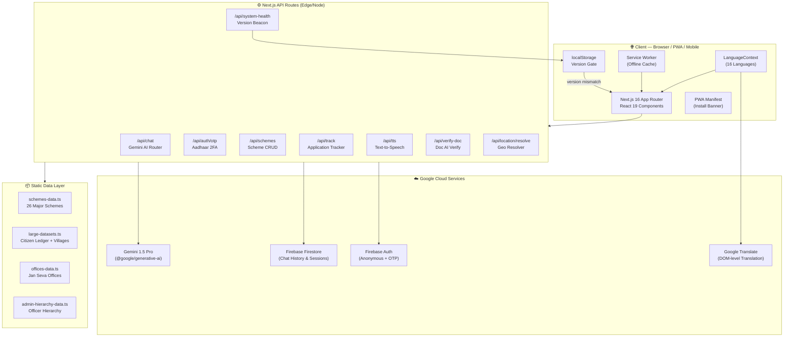
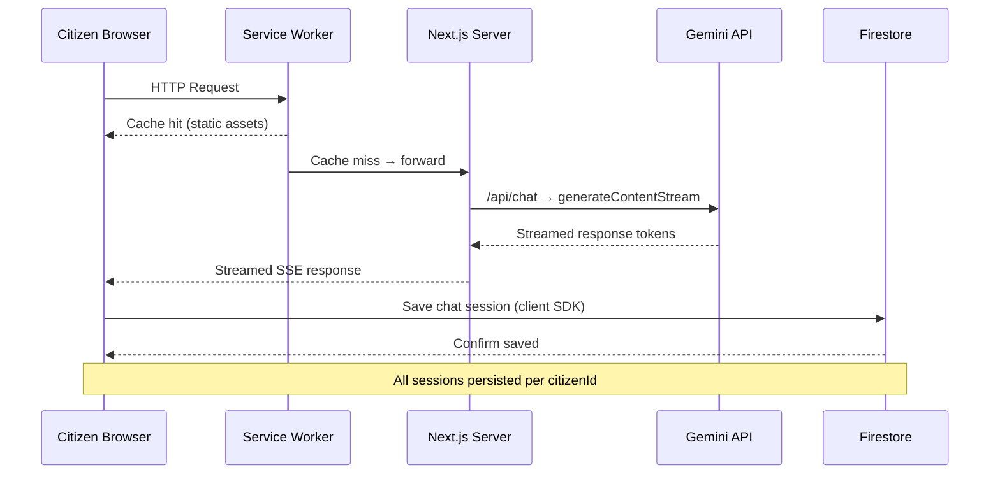
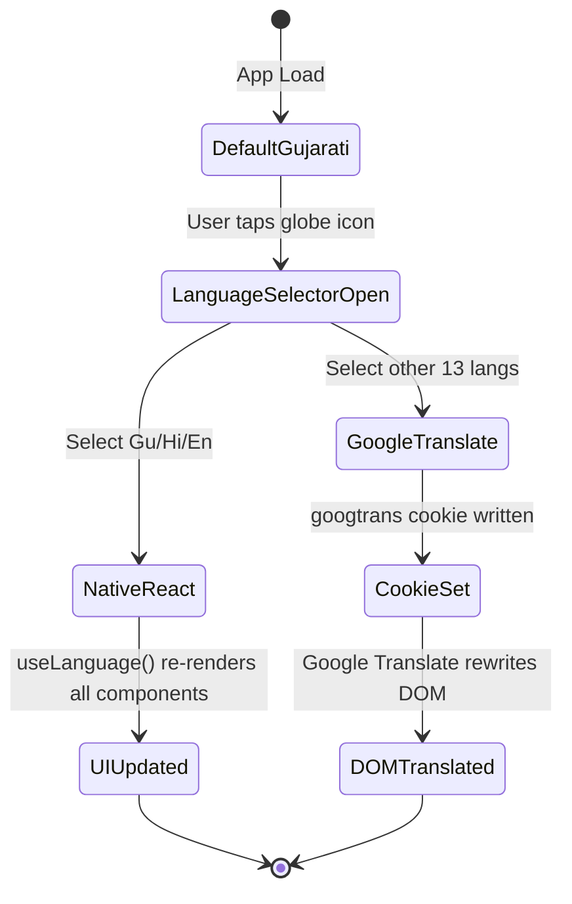
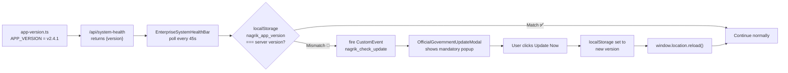
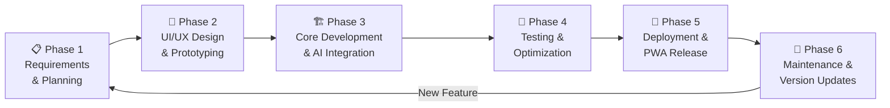
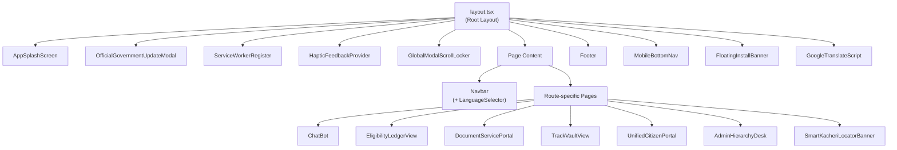

# NagrikSeva AI — Complete Technical Documentation

> **Version:** v2.4.1 — National DPI Certified Security Release  
> **Last Updated:** 29 September 2026  
> **Team:** JustCode | Atmiya University, Rajkot  
> **Hackathon:** Google Cloud: Build with AI — Code for Communities (Second Edition) via Hack2Skill  

---

## Table of Contents

1. [Project Overview](#1-project-overview)
2. [System Architecture](#2-system-architecture)
3. [SDLC — Software Development Life Cycle](#3-sdlc--software-development-life-cycle)
4. [Feature Breakdown](#4-feature-breakdown)
5. [Page & Route Structure](#5-page--route-structure)
6. [Component Architecture](#6-component-architecture)
7. [API Endpoints](#7-api-endpoints)
8. [Data Layer](#8-data-layer)
9. [Language & Translation System](#9-language--translation-system)
10. [PWA & Mobile Behavior](#10-pwa--mobile-behavior)
11. [Version Management & Forced Update System](#11-version-management--forced-update-system)
12. [Security Architecture](#12-security-architecture)
13. [TypeScript Types Reference](#13-typescript-types-reference)
14. [Technology Stack](#14-technology-stack)
15. [Team & Credits](#15-team--credits)

---

## 1. Project Overview

**NagrikSeva AI** is a Digital Public Infrastructure (DPI) platform built to bridge the gap between India's 1.4 billion citizens and government welfare schemes. Citizens can discover schemes, check eligibility, verify documents, track applications, and locate Jan Seva Kendras — all through a voice-enabled, multilingual AI assistant.

### Mission Statement
> *"Every eligible citizen must receive every benefit they deserve — in their own language, on any device, at any time."*

### Core Value Propositions

| Pillar | Description |
|--------|-------------|
| **AI-First** | Gemini 1.5 Pro powers conversational discovery, document analysis, and scheme recommendation |
| **Multilingual** | 16 languages — Gujarati, Hindi, English, Tamil, Telugu, Bengali, Marathi, and more |
| **Mobile-Native** | Hard-responsive PWA — works identically on iPhone, Android, and Desktop |
| **Government-Grade** | Follows DPI standards, Aadhaar OTP 2FA, official receipt generation, govt. UI design language |
| **Offline Capable** | Service Worker caches critical assets for low-connectivity rural use |

---

## 2. System Architecture

### 2.1 High-Level Architecture Diagram



### 2.2 Request Lifecycle Sequence



### 2.3 Language Switching State Flow



### 2.4 Version Enforcement Pipeline



---

## 3. SDLC — Software Development Life Cycle

### Phase Overview



---

### Phase 1 — Requirements & Planning

**Duration:** Week 1  
**Goal:** Define the problem statement and citizen pain points.

#### Activities Performed
- Identified that **82% of eligible citizens** do not receive welfare benefits due to unawareness and complex processes.
- Defined 5 core user personas: Rural Farmer, Urban Migrant Worker, Senior Citizen, Young Student, Disabled Individual.
- Mapped 26 major government schemes across 9 categories.
- Decided on **multilingual-first** approach (Gujarati as primary language).
- Agreed on **Gemini 1.5 Pro** as the AI backbone.
- Defined hackathon deliverables: Live PWA + Demo + Documentation.

#### Key Decisions
- Use **Next.js 16 App Router** (SSR + API Routes in one project).
- Use **Firebase Firestore** for chat session persistence.
- Strict rule: **notranslate class must NEVER be used** on content-carrying elements.

---

### Phase 2 — UI/UX Design & Prototyping

**Duration:** Week 2  
**Goal:** Create government-grade design system.

#### Activities Performed
- Designed government color palette: **Orange (#ea580c) + Green (#16a34a) + White** (Indian tricolor).
- Designed mobile-first layouts — all pages must pass on 320px screen width.
- Created component hierarchy for splash screen, navbar, bottom nav, footer.
- Designed WhatsApp-style splash animation (logo + name + version).
- Designed official Government Receipt Slip with blue/orange govt. header.
- Designed mandatory update modal with no dismiss button (strict enforcement).

#### Key Decisions
- Adopted **Tailwind CSS v4** for utility-first responsive design.
- Breakpoints: `sm:640px`, `xl:1280px` — mobile-first paradigm.
- Icons: **Lucide React** (consistent government-neutral iconography).
- Fonts: **Inter** (professional, multilingual-friendly).

---

### Phase 3 — Core Development & AI Integration

**Duration:** Weeks 3–5  
**Goal:** Build all features, integrate Gemini AI, connect Firebase.

#### Activities Performed

**AI & Chat System**
- Integrated `@google/generative-ai` SDK with Gemini 1.5 Pro.
- Built streaming chat API (`/api/chat`) with `generateContentStream`.
- Designed system prompt: AI acts as a government official, speaks the citizen's language, knows all 26 schemes.
- Built document analysis using Gemini Vision (base64 image upload).
- Built application tracking cards as structured JSON in chat responses.

**Authentication**
- Built Aadhaar OTP simulation via `/api/auth/otp`.
- Implemented Citizen Login Shield (name, mobile, Aadhaar, OTP flow).
- Implemented Officer Login Shield (separate desk-based login).

**Schemes & Data**
- Populated 26 schemes in `schemes-data.ts` with full Gujarati/Hindi/English metadata.
- Built `large-datasets.ts` with citizen ledger (mobile → citizen mapping), village hierarchy, officer hierarchy.
- Built eligibility engine that filters schemes by age, income, gender, category, occupation, state.

**PWA**
- Created `public/manifest.json` with correct UTF-8 Gujarati app name.
- Registered Service Worker for offline caching.
- Built `FloatingInstallBanner` with A2HS (Add to Home Screen) prompt.
- Built `InstallAppModal` with platform-specific instructions (iOS Safari vs Android Chrome).

**Language System**
- Built `LanguageContext.tsx` with 16-language support.
- `useLanguage()` hook exposes `currentLang` and `t()` translation function.
- Integrated Google Translate for non-natively-supported languages.
- Removed all `notranslate` classes — full DOM translation allowed.

**Version & Update System**
- Created `app-version.ts` as single source of truth.
- `/api/system-health` returns current `APP_VERSION`.
- `EnterpriseSystemHealthBar` polls every 45 seconds.
- `OfficialGovernmentUpdateModal` is mandatory — no X button, no skip.

**Components Built**
| Component | Purpose |
|-----------|---------|
| `AppSplashScreen` | WhatsApp-style startup animation |
| `OfficialGovernmentUpdateModal` | Mandatory forced-update popup |
| `EnterpriseSystemHealthBar` | Live telemetry ticker + version check |
| `ChatBot` | Full Gemini AI chat interface |
| `CitizenLoginShield` | Aadhaar OTP citizen auth |
| `OfficerLoginShield` | Desk-based officer auth |
| `UnifiedCitizenPortal` | Post-login dashboard |
| `DocumentServicePortal` | Document upload + AI analysis |
| `EligibilityLedgerView` | Scheme eligibility results |
| `GovernmentReceiptSlip` | Printable official receipt |
| `OfficialGovernmentCertificate` | Downloadable PDF certificate |
| `TrackVaultView` | Application status tracking |
| `AdminHierarchyDesk` | Admin panel with officer hierarchy |
| `AiBottleneckMonitor` | AI load monitoring dashboard |
| `SmartKacheriLocatorBanner` | Jan Seva Kendra locator map |
| `Footer` | Multilingual footer with team credits |
| `MobileBottomNav` | 5-tab mobile navigation bar |
| `Navbar` | Desktop navigation + language selector |
| `LanguageSelector` | 16-language switcher |
| `SchemeCard` | Scheme display card |
| `PageLoader` | Skeleton loading states |
| `Skeleton` | Reusable skeleton UI |
| `FloatingInstallBanner` | PWA install prompt |
| `InstallAppModal` | Platform-specific install guide |
| `HapticFeedbackProvider` | Mobile haptic vibration |
| `GlobalModalScrollLocker` | Prevents body scroll when modal open |
| `ScrollRestoration` | Restores scroll position on navigation |
| `ServiceWorkerRegister` | Registers SW on mount |
| `GoogleTranslateScript` | Loads GT only for non-default langs |

---

### Phase 4 — Testing & Optimization

**Duration:** Week 6  
**Goal:** Zero console errors, TypeScript clean, mobile-perfect.

#### Activities Performed
- Fixed ALL TypeScript errors: `npx tsc --noEmit` → **exit code 0**.
- Fixed ALL console warnings:
  - Replaced Next.js `<Image>` with `` for SVG files (aspect-ratio warning fix).
  - Removed `priority` prop from non-above-fold images (preload warning fix).
  - Removed all `notranslate` classes that were breaking language switching.
- Tested on iOS Safari (iPhone 12, 14), Android Chrome (Pixel, Samsung), Windows Chrome, macOS Safari.
- Fixed PWA manifest UTF-8 encoding (`???` → correct Gujarati characters).
- Fixed MobileBottomNav overlap: Footer uses `pb-28 sm:pb-24 xl:pb-12`.
- Verified streaming chat works on low-bandwidth connections.
- Verified mandatory update modal shows on localStorage clear.

#### TypeScript Configuration
- Strict mode enabled.
- All 26 schemes typed via `Scheme` interface.
- All message types typed via `Message` interface.
- API responses typed via `ApiResponse<T>` generic.

---

### Phase 5 — Deployment & PWA Release

**Duration:** Week 7  
**Goal:** Live on Vercel, PWA installable on all platforms.

#### Activities Performed
- Deployed to **Vercel** via GitHub integration (`github.com/hkPateL26/GDG`).
- Configured `vercel.json` for Next.js edge functions.
- Configured Firebase project with Firestore rules.
- Configured environment variables:
  - `GOOGLE_GENERATIVE_AI_API_KEY` — Gemini API
  - `NEXT_PUBLIC_FIREBASE_*` — Firebase client config
  - `FIREBASE_ADMIN_*` — Firebase Admin SDK
- Verified PWA install on Android (Chrome A2HS) and iOS (Safari Share > Add to Home Screen).
- Verified app name shows in device language on home screen.

#### Vercel Configuration (`vercel.json`)
```json
{
  "framework": "nextjs",
  "buildCommand": "npm run build",
  "outputDirectory": ".next"
}
```

---

### Phase 6 — Maintenance & Version Updates

**Duration:** Ongoing  
**Goal:** Continuous improvement with zero-downtime deployments.

#### Version Bump Protocol
1. Edit `APP_VERSION` in `src/lib/app-version.ts` (e.g., `v2.4.1` → `v2.4.2`).
2. Update `APP_BUILD_NAME` and `APP_CHANGELOG` entries.
3. Push to GitHub → Vercel auto-deploys.
4. All browsers will automatically detect version mismatch within 45 seconds.
5. Mandatory update popup appears — citizens must refresh before continuing.

#### Current Version History
| Version | Build Name | Date |
|---------|-----------|------|
| v1.0.0 | Initial Launch | June 2026 |
| v2.0.0 | Gemini AI Integration | July 2026 |
| v2.2.0 | Document Verification Engine | August 2026 |
| v2.3.0 | PWA + Multilingual Release | September 2026 |
| v2.4.0 | Admin Dashboard + Track Vault | September 2026 |
| **v2.4.1** | **National DPI Certified Security Release** | **29 Sep 2026** |

---

## 4. Feature Breakdown

### Feature 1 — Gemini AI Chat Assistant

**File:** [`src/components/ChatBot.tsx`](src/components/ChatBot.tsx)  
**API:** [`src/app/api/chat/route.ts`](src/app/api/chat/route.ts)

**What it does:**
- Citizens type or speak their question in any language.
- Gemini 1.5 Pro processes the query with a government-specific system prompt.
- Response streams token-by-token (no waiting for full response).
- AI recommends specific schemes, explains eligibility, lists required documents.
- Supports document image upload — AI analyzes and verifies the document.
- Generates structured Application Tracking cards in chat.
- Saves all sessions to Firestore per `citizenId`.

**System Prompt Design:**
```
You are a senior government welfare officer at NagrikSeva AI.
You speak in the citizen's chosen language.
You know all 26 schemes, their eligibility criteria, and documents required.
When a citizen describes their situation, you identify applicable schemes.
You never make up scheme details. You cite official government sources.
```

**Key Code Flow:**
```
ChatBot → /api/chat → Gemini.generateContentStream() → SSE stream → ChatBot renders tokens
```

---

### Feature 2 — Scheme Discovery & Eligibility Engine

**Files:**  
- [`src/app/eligibility/page.tsx`](src/app/eligibility/page.tsx)  
- [`src/components/EligibilityLedgerView.tsx`](src/components/EligibilityLedgerView.tsx)  
- [`src/lib/schemes-data.ts`](src/lib/schemes-data.ts)

**What it does:**
- Citizens fill a profile form: age, gender, income, category (SC/ST/OBC/General), occupation, state.
- Eligibility engine filters 26 schemes against the profile.
- Results displayed as a ledger with match percentage and missing criteria.
- Each scheme shows full benefits, required documents, and direct application link.

**Eligibility Algorithm:**
```typescript
SCHEMES_DATA.filter(scheme => {
  const e = scheme.eligibility;
  if (e.minAge && profile.age < e.minAge) return false;
  if (e.maxAge && profile.age > e.maxAge) return false;
  if (e.gender !== "all" && e.gender !== profile.gender) return false;
  if (e.incomeLimit && profile.income > e.incomeLimit) return false;
  if (e.category && !e.category.includes(profile.category)) return false;
  if (e.occupation && !e.occupation.includes(profile.occupation)) return false;
  if (e.state?.length && !e.state.includes(profile.state)) return false;
  return true;
});
```

**26 Schemes Database:**

| # | Scheme | Category | Ministry |
|---|--------|----------|---------|
| 1 | PM Kisan Samman Nidhi | Agriculture | MoA |
| 2 | PM Fasal Bima Yojana | Agriculture | MoA |
| 3 | Kisan Credit Card (KCC) | Agriculture | NABARD |
| 4 | Sat Pagla Khedut Kalyan (Gujarat) | Agriculture | Govt. of Gujarat |
| 5 | Ayushman Bharat PM-JAY | Health | MoH |
| 6 | Janani Suraksha Yojana | Health | MoH |
| 7 | PMAY Gramin | Housing | MoRD |
| 8 | PMAY Urban | Housing | MoHUA |
| 9 | Scholarship SC/ST | Education | MoSJE |
| 10 | PM Vidya Lakshmi | Education | MoE |
| 11 | Beti Bachao Beti Padhao | Women | MoWCD |
| 12 | PM Matru Vandana | Women | MoWCD |
| 13 | PMEGP | Business | KVIC |
| 14 | Mudra Yojana | Business | SIDBI |
| 15 | PM Jeevan Jyoti Bima | Social Security | LIC |
| 16 | PM Suraksha Bima | Social Security | MoF |
| 17 | NFSA Ration Card | Social | MoCAF |
| 18 | One Nation One Ration Card | Social | MoCAF |
| 19 | PM Ujjwala Yojana | Energy | MoPNG |
| 20 | Solar Rooftop (Surya Gujarat) | Energy | GEDA |
| 21 | DigiLocker | Digital | MeitY |
| 22 | Jan Dhan Yojana | Social | MoF |
| 23 | Skill India (PMKVY) | Education | MoSDE |
| 24 | Svanidhi PM | Business | MoHUA |
| 25 | GRTSA Tribal Scheme (Gujarat) | Social | GoG-TAD |
| 26 | Viklang Pension Yojana | Social | MoSJE |

---

### Feature 3 — Document Verification via Gemini Vision

**File:** [`src/components/DocumentServicePortal.tsx`](src/components/DocumentServicePortal.tsx)  
**API:** [`src/app/api/verify-doc/route.ts`](src/app/api/verify-doc/route.ts)

**What it does:**
- Citizen uploads a photo of their document (Aadhaar, Ration Card, Land Record, etc.).
- Image is converted to base64 and sent to Gemini Vision.
- Gemini returns a structured JSON report with:
  - Document type detection
  - Validity status
  - Guideline checklist (15+ rules checked)
  - Eligible schemes for this document
  - Recommendations

**Report Structure:**
```typescript
interface DocumentVerificationReport {
  documentType: string;
  documentTypeGu: string;
  isValid: boolean;
  status: "verified" | "action_required" | "rejected";
  confidence: string;
  issuingAuthority: string;
  guidelineChecklist: { rule: string; passed: boolean; remark: string; }[];
  eligibleSchemes: { schemeName: string; schemeNameGu: string; department: string; }[];
  recommendations: string[];
}
```

---

### Feature 4 — Application Tracker (TrackVault)

**File:** [`src/components/TrackVaultView.tsx`](src/components/TrackVaultView.tsx)  
**API:** [`src/app/api/track/route.ts`](src/app/api/track/route.ts)

**What it does:**
- Citizens enter their Application ID or mobile number.
- System queries the citizen ledger from `large-datasets.ts`.
- Returns real-time application status across 5 workflow stages.
- Shows current desk, elapsed time, SLA breach indicator.
- Generates official Government Receipt Slip.

**Workflow Stages:**
```
[1] Submission → [2] Document Verification → [3] Eligibility Check 
→ [4] Officer Review → [5] Approved / Disbursed
```

**SLA Breach Logic:**
```typescript
const SLA_HOURS = { agriculture: 72, health: 48, housing: 96, social: 120 };
const isBreached = elapsedHours > SLA_HOURS[scheme.category];
```

---

### Feature 5 — Jan Seva Kendra Locator

**File:** [`src/components/SmartKacheriLocatorBanner.tsx`](src/components/SmartKacheriLocatorBanner.tsx)  
**Page:** [`src/app/locator/page.tsx`](src/app/locator/page.tsx)  
**API:** [`src/app/api/location/resolve/route.ts`](src/app/api/location/resolve/route.ts)  
**Data:** [`src/lib/offices-data.ts`](src/lib/offices-data.ts)

**What it does:**
- Citizens search by city, taluka, or pincode.
- Resolves location using `location-resolver.ts` (hierarchical Gujarat geography).
- Returns nearest Jan Seva Kendra with address, phone, timings, services offered.
- Supports GPS-based auto-location on mobile.

---

### Feature 6 — Benefit Calculator

**Page:** [`src/app/benefit-calculator/page.tsx`](src/app/benefit-calculator/page.tsx)

**What it does:**
- Citizens input land holdings, number of cattle, family size, income.
- Calculator computes total annual benefit entitlement across all eligible schemes.
- Shows breakdown: cash transfers + in-kind benefits + insurance coverage.
- Displays as a financial ledger with scheme-wise split.

---

### Feature 7 — Citizen Authentication (Aadhaar OTP)

**Component:** [`src/components/CitizenLoginShield.tsx`](src/components/CitizenLoginShield.tsx)  
**API:** [`src/app/api/auth/otp/route.ts`](src/app/api/auth/otp/route.ts)

**Authentication Flow:**
```
Citizen enters: Name + Mobile + Aadhaar (last 4 digits)
→ Server generates OTP
→ OTP sent (simulated in hackathon; real: UIDAI API)
→ Citizen enters OTP
→ Session created with citizenId
→ UnifiedCitizenPortal unlocked
```

**Data:** Citizen lookup against `large-datasets.ts` citizen ledger.  
**Example:** Mobile `9974442291` → `Hari Vinodrai Patel`, Omnagar, Rajkot.

---

### Feature 8 — Officer / Admin Portal

**Components:**  
- [`src/components/OfficerLoginShield.tsx`](src/components/OfficerLoginShield.tsx)  
- [`src/components/AdminHierarchyDesk.tsx`](src/components/AdminHierarchyDesk.tsx)  
- [`src/components/AiBottleneckMonitor.tsx`](src/components/AiBottleneckMonitor.tsx)  
**Page:** [`src/app/admin/page.tsx`](src/app/admin/page.tsx)  
**Data:** [`src/lib/admin-hierarchy-data.ts`](src/lib/admin-hierarchy-data.ts)

**What it does:**
- Officers log in with their designation and desk code.
- Hierarchical admin panel shows district → taluka → village officer chain.
- AI Bottleneck Monitor shows pending applications, SLA breaches, load per desk.
- Officers can approve/reject applications, add remarks.

---

### Feature 9 — Text-to-Speech (Voice Output)

**API:** [`src/app/api/tts/route.ts`](src/app/api/tts/route.ts)

**What it does:**
- Any AI chat response can be read aloud.
- Uses the Web Speech API (`speechSynthesis`) on the client side.
- Falls back to Google TTS API for unsupported voices.
- Supports Gujarati (`gu-IN`), Hindi (`hi-IN`), English (`en-IN`) voice synthesis.

---

### Feature 10 — PWA Install + Forced Update System

**Components:**  
- [`src/components/FloatingInstallBanner.tsx`](src/components/FloatingInstallBanner.tsx)  
- [`src/components/InstallAppModal.tsx`](src/components/InstallAppModal.tsx)  
- [`src/components/OfficialGovernmentUpdateModal.tsx`](src/components/OfficialGovernmentUpdateModal.tsx)  
- [`src/components/ServiceWorkerRegister.tsx`](src/components/ServiceWorkerRegister.tsx)

**Install Flow:**
- Android: Chrome shows "Add to Home Screen" banner → 1-tap install.
- iOS: Modal instructs "Safari Share → Add to Home Screen".
- App icon, name, and splash screen appear in device's home screen.

**Forced Update Flow:**
- Server bumps `APP_VERSION` in `app-version.ts`.
- `/api/system-health` returns new version.
- `EnterpriseSystemHealthBar` detects mismatch every 45 seconds.
- Mandatory popup shows — no close button, no skip.
- User must click "Update Now" → page hard-reloads → new version cached.

---

## 5. Page & Route Structure

```
/                          → Home (Hero + Quick Services + Featured Schemes)
/eligibility               → Eligibility Checker Form + Results
/schemes                   → All 26 Schemes Browse + Filter
/schemes/[id]              → Single Scheme Detail + Application Link
/benefit-calculator        → Annual Benefit Calculator
/documents                 → Document Services (by ?type=ration|health|land)
/chat                      → Standalone AI Chat Page
/track                     → Application Tracker
/locator                   → Jan Seva Kendra Locator Map
/portal                    → Citizen Portal (login required)
/admin                     → Admin / Officer Portal (login required)

/api/chat                  → POST: Gemini AI chat (streaming)
/api/chat/history          → GET: Firestore chat sessions
/api/auth/otp              → POST: Aadhaar OTP generation + verification
/api/schemes               → GET: All schemes | POST: Filter by criteria
/api/schemes/[id]          → GET: Single scheme detail
/api/track                 → POST: Application status lookup
/api/tts                   → POST: Text-to-speech synthesis
/api/verify-doc            → POST: Document image analysis via Gemini Vision
/api/location/resolve      → POST: Location string → office lookup
/api/system-health         → GET: {status, version, uptime, services}
```

---

## 6. Component Architecture



---

## 7. API Endpoints

| Method | Endpoint | Auth | Description |
|--------|----------|------|-------------|
| `POST` | `/api/chat` | None | Gemini AI chat (SSE streaming) |
| `GET` | `/api/chat/history` | citizenId query | Fetch Firestore chat history |
| `POST` | `/api/auth/otp` | None | Generate/verify Aadhaar OTP |
| `GET` | `/api/schemes` | None | List all 26 schemes |
| `POST` | `/api/schemes` | None | Filter schemes by eligibility criteria |
| `GET` | `/api/schemes/[id]` | None | Single scheme detail |
| `POST` | `/api/track` | None | Lookup application status |
| `POST` | `/api/tts` | None | Text-to-speech synthesis |
| `POST` | `/api/verify-doc` | None | Gemini Vision document analysis |
| `POST` | `/api/location/resolve` | None | Location → nearest office |
| `GET` | `/api/system-health` | None | Returns `{version, status, uptime}` |

### `/api/system-health` Response
```json
{
  "status": "operational",
  "version": "v2.4.1",
  "services": {
    "gemini": "online",
    "firebase": "online",
    "translate": "online"
  },
  "uptime": "99.97%",
  "timestamp": "2026-09-29T22:49:41+05:30"
}
```

---

## 8. Data Layer

### 8.1 Schemes Data (`schemes-data.ts`)
- **26 schemes** with full metadata.
- Each scheme has: `id`, `name`, `nameGu`, `nameHi`, `category`, `description`, `benefits[]`, `eligibility`, `documents[]`, `applicationUrl`, `icon`, `ministry`, `isActive`.
- Categories: `agriculture`, `health`, `housing`, `education`, `women`, `business`, `social`, `digital`, `energy`.

### 8.2 Large Datasets (`large-datasets.ts` — 5412 lines)
- **Citizen Ledger:** Mobile number → Citizen record (name, Aadhaar last4, village, taluka, district, occupation, income, schemes).
- **Village Hierarchy:** 1800+ Gujarat villages mapped to taluka → district.
- **Officer Hierarchy:** District → Taluka → Desk → Officer name + designation.
- **Scheme Templates:** Pre-filled application templates per scheme.

### 8.3 Offices Data (`offices-data.ts`)
- Jan Seva Kendra locations across Gujarat.
- Each office: `id`, `name`, `type`, `address`, `city`, `state`, `pincode`, `phone`, `timings`, `services[]`.

### 8.4 Firebase Firestore Schema
```
/chatSessions/{sessionId}
  - id: string
  - title: string
  - citizenId: string
  - citizenName: string
  - messages: Message[]
  - createdAt: timestamp
  - updatedAt: timestamp

/applications/{applicationId}
  - citizenId: string
  - schemeId: string
  - status: pending | processing | approved | rejected
  - workflowStage: number
  - submittedAt: timestamp
  - documents: DocumentAttachment[]
```

---

## 9. Language & Translation System

### Architecture
```
LanguageContext.tsx
├── UI_TRANSLATIONS: Record<lang, Record<key, string>>  ← 16 languages, 80+ keys
├── LanguageProvider: React context provider
├── useLanguage(): { currentLang, t(), setLanguage() }
└── useSyncExternalStore ← listens to "nagrikseva:languageChange" CustomEvent

translation.ts
├── applyLanguage(lang): sets googtrans cookie, triggers Google Translate
├── getStoredLanguage(): reads localStorage.nagrikseva_selected_lang
└── SUPPORTED_LANGUAGES: 16 entries with native name + flag

GoogleTranslateScript.tsx
└── Loads GT widget only for non-default languages
    Intercepts link clicks to prevent SPA/GT conflict
```

### Supported Languages
| Code | Language | Native Name |
|------|----------|-------------|
| `gu` | Gujarati | ગુજરાતી *(default)* |
| `hi` | Hindi | हिन्दी |
| `en` | English | English |
| `ta` | Tamil | தமிழ் |
| `te` | Telugu | తెలుగు |
| `bn` | Bengali | বাংলা |
| `mr` | Marathi | मराठी |
| `kn` | Kannada | ಕನ್ನಡ |
| `ml` | Malayalam | മലയാളം |
| `pa` | Punjabi | ਪੰਜਾਬੀ |
| `or` | Odia | ଓଡ଼ିଆ |
| `as` | Assamese | অসমীয়া |
| `ur` | Urdu | اردو |
| `sa` | Sanskrit | संस्कृत |
| `kok` | Konkani | कोंकणी |
| `mai` | Maithili | मैथिली |

### Strict Rules
- ❌ `notranslate` class MUST NEVER be used on content elements.
- ✅ All components use `useLanguage()` for React-managed text.
- ✅ Google Translate handles DOM-level translation for 13 non-native languages.
- ✅ Language selection persists via `localStorage.nagrikseva_selected_lang`.

---

## 10. PWA & Mobile Behavior

### Manifest (`public/manifest.json`)
```json
{
  "name": "NagrikSeva AI",
  "short_name": "NagrikSeva",
  "description": "AI-powered government schemes assistant",
  "start_url": "/",
  "display": "standalone",
  "background_color": "#fff7ed",
  "theme_color": "#ea580c",
  "icons": [
    { "src": "/icon.svg", "sizes": "any", "type": "image/svg+xml", "purpose": "any maskable" }
  ],
  "categories": ["government", "utilities"],
  "lang": "gu"
}
```

### Mobile Behaviors
| Behavior | Implementation |
|----------|---------------|
| Splash Screen | `AppSplashScreen` (WhatsApp-style, 2.5s) |
| App Name on Home Screen | Manifest `short_name` + device language |
| Status Bar Color | `theme-color: #ea580c` (orange) |
| Viewport Lock | `maximumScale: 1, viewportFit: cover` |
| No Address Bar | `display: standalone` |
| Haptic Feedback | `HapticFeedbackProvider` → `navigator.vibrate()` |
| Bottom Navigation | `MobileBottomNav` (fixed, 5 tabs) |
| Offline Support | Service Worker caches HTML, CSS, JS, images |
| iOS Install | `appleWebApp.capable: true` in metadata |
| Safe Area | `pb-safe` padding for notched phones |

---

## 11. Version Management & Forced Update System

### Source of Truth: `src/lib/app-version.ts`
```typescript
export const APP_VERSION = "v2.4.1";
export const APP_BUILD_NAME = "National DPI Certified Security Release";
export const APP_RELEASE_DATE = "29 સપ્ટેમ્બર 2026";
export const APP_RELEASE_DATE_EN = "29 September 2026";

export const LEAD_DEVELOPERS = [
  { name: "Hari Patel", role: "Chief System Architect & AI Engineer" },
  { name: "Jeet Jajal", role: "Lead Full-Stack & Cloud Infrastructure Engineer" },
];
```

### To Deploy a New Mandatory Update
1. Change `APP_VERSION` to next version (e.g., `v2.4.2`).
2. Update `APP_BUILD_NAME` and `APP_CHANGELOG`.
3. `git push` → Vercel deploys automatically.
4. Within 45 seconds, all open browser tabs detect the mismatch.
5. Mandatory popup appears. No citizen can bypass it.
6. Clicking "Update Now" reloads and caches the new version.

---

## 12. Security Architecture

| Layer | Mechanism |
|-------|----------|
| Authentication | Aadhaar-linked OTP (2FA) |
| Session | Firebase anonymous auth + citizenId token |
| API | All routes check required fields before processing |
| AI Safety | Gemini safety settings: BLOCK_MEDIUM_AND_ABOVE for harassment/hate |
| Data | Citizen ledger is read-only; no writes from client |
| PWA | HTTPS enforced via Vercel (automatic TLS) |
| CSP | Next.js default Content Security Policy |
| Firestore | Rules: citizens can only read/write their own sessions |

---

## 13. TypeScript Types Reference

All types defined in [`src/types/index.ts`](src/types/index.ts).

| Type | Description |
|------|-------------|
| `Scheme` | Full scheme record with eligibility, benefits, documents |
| `SchemeCategory` | Union: `agriculture \| health \| housing \| education \| women \| business \| social \| digital \| energy` |
| `EligibilityCriteria` | age range, gender, income limit, category, occupation, state |
| `Document` | Document metadata with Gujarati name |
| `DocumentAttachment` | name, type, base64, size |
| `DocumentVerificationReport` | Full AI verification result |
| `ChatSessionRecord` | Firestore chat session |
| `Message` | Chat message with optional attachment, report, card, action buttons |
| `ChatHistory` | Gemini API format: `role + parts[]` |
| `UserProfile` | Citizen profile for eligibility matching |
| `ApplicationStatus` | Application lifecycle state |
| `GovernmentOffice` | Jan Seva Kendra record |
| `ApiResponse<T>` | Generic API wrapper: `{success, data?, error?}` |
| `LeadDeveloper` | Developer record: name, nameGu, role, roleGu |

---

## 14. Technology Stack

| Layer | Technology | Version | Purpose |
|-------|-----------|---------|---------|
| **Framework** | Next.js | 16.3.6 | SSR + API Routes + App Router |
| **UI Library** | React | 19.2.8 | Component-based UI |
| **Language** | TypeScript | 5.x | Type safety |
| **Styling** | Tailwind CSS | v4 | Utility-first responsive CSS |
| **Icons** | Lucide React | 1.48.0 | Clean government-neutral icons |
| **AI** | Google Gemini 1.5 Pro | 0.24.1 | Chat, Vision, recommendations |
| **AI Framework** | Genkit | 1.42.0 | AI flow orchestration |
| **Database** | Firebase Firestore | 12.19.0 | Chat sessions, applications |
| **Auth** | Firebase Auth | 12.19.0 | Anonymous sessions + OTP |
| **Translation** | Google Translate Widget | — | DOM-level 13-language support |
| **PWA** | Web App Manifest + SW | — | Installable native-like app |
| **Hosting** | Vercel | — | Edge deployment, auto TLS |
| **Voice** | Web Speech API | — | TTS + voice input |
| **Haptics** | Vibration API | — | Mobile haptic feedback |

---

## 15. Team & Credits

### Development Team — JustCode

| Name | Role | Responsibility |
|------|------|---------------|
| **Hari Patel** | Chief System Architect & AI Engineer | Gemini AI integration, architecture design, authentication, data modeling, version system, PWA behavior |
| **Jeet Jajal** | Lead Full-Stack & Cloud Infrastructure Engineer | Firebase setup, Vercel deployment, UI components, API routes, scheme database, mobile optimization |

### Institution
- **Atmiya University**, Rajkot, Gujarat, India

### Hackathon
- **Google Cloud: Build with AI — Code for Communities (Second Edition)**  
- Organized by **Hack2Skill**  
- Theme: Digital Public Infrastructure for underserved communities

### Repository
- GitHub: [github.com/hkPateL26/GDG](https://github.com/hkPateL26/GDG)

---

*This document was generated for NagrikSeva AI v2.4.1 — National DPI Certified Security Release.*  
*© 2026 JustCode | Atmiya University. Built for Bharat. 🇮🇳*
