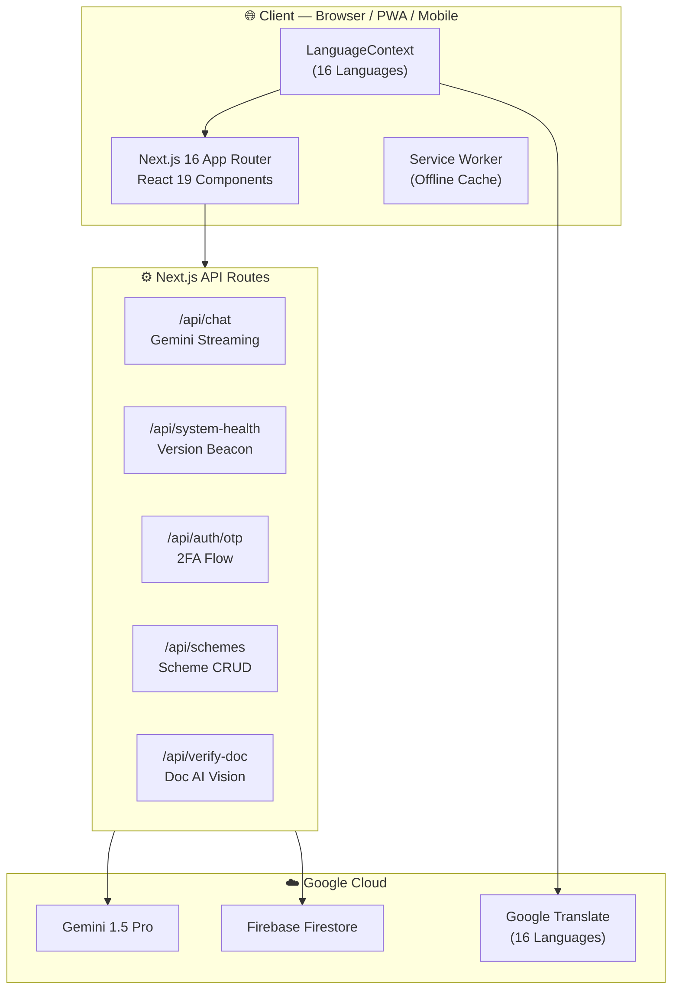
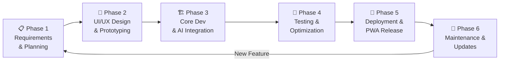

# 🇮🇳 NagrikSeva AI

> **AI-Powered Digital Public Infrastructure Assistant for Bharat**

[](src/lib/app-version.ts)
[](https://nextjs.org)
[](https://react.dev)
[](https://ai.google.dev)
[](https://firebase.google.com)
[](https://tailwindcss.com)
[](public/manifest.json)
[](tsconfig.json)

**Hackathon:** Google Cloud: Build with AI — Code for Communities (Second Edition) via Hack2Skill  
**College:** Atmiya University, Rajkot, Gujarat  
**Team:** JustCode — *"We don't talk, we build."*

---

## 🎯 What is NagrikSeva AI?

NagrikSeva AI bridges the gap between India's 1.4 billion citizens and government welfare schemes. Citizens discover schemes, check eligibility, verify documents, track applications, and locate Jan Seva Kendras — all through a voice-enabled, multilingual AI assistant that works like a government officer in your pocket.

> *"Every eligible citizen must receive every benefit they deserve — in their own language, on any device, at any time."*

---

## 🏗️ System Architecture



---

## ✨ Features

| # | Feature | Description |
|---|---------|-------------|
| 🤖 | **Gemini AI Chat** | Streaming Gemini 1.5 Pro chat — asks about your situation and recommends schemes in your language |
| 🔍 | **Scheme Discovery** | Browse and filter all 26 government schemes by category (agriculture, health, housing, education, women, business) |
| ✅ | **Eligibility Engine** | Fill a profile → instantly see which schemes you qualify for with match percentage |
| 📄 | **Document Verifier** | Upload Aadhaar, Ration Card, Land Record — AI checks authenticity and guideline compliance |
| 📍 | **Jan Seva Locator** | Find the nearest Jan Seva Kendra by city, taluka, or GPS |
| 💰 | **Benefit Calculator** | Calculate total annual benefit entitlement across all eligible schemes |
| 📊 | **Application Tracker** | Track your application status across 5 workflow stages in real time |
| 👮 | **Officer Portal** | Admin dashboard with officer hierarchy, SLA breach monitor, AI bottleneck alerts |
| 🔐 | **Aadhaar OTP Auth** | Secure 2FA login for citizens — mobile + Aadhaar last-4 + OTP |
| 📱 | **PWA Install** | 1-tap install on Android, Add to Home Screen on iOS — works like a native app |
| 🔊 | **Voice TTS** | Read any AI response aloud in Gujarati, Hindi, or English |
| 🔄 | **Forced Updates** | Server-pushed mandatory updates — no citizen can skip a security update |

---

## 📁 Project Structure

```
nagrik-seva/
├── src/
│   ├── app/                          # Next.js App Router pages
│   │   ├── page.tsx                  # Home page (hero + quick services)
│   │   ├── layout.tsx                # Root layout (global components)
│   │   ├── eligibility/page.tsx      # Eligibility checker
│   │   ├── schemes/page.tsx          # Browse all 26 schemes
│   │   ├── schemes/[id]/page.tsx     # Single scheme detail
│   │   ├── benefit-calculator/       # Annual benefit calculator
│   │   ├── documents/page.tsx        # Document services
│   │   ├── chat/page.tsx             # Standalone AI chat
│   │   ├── track/page.tsx            # Application tracker
│   │   ├── locator/page.tsx          # Jan Seva Kendra locator
│   │   ├── portal/page.tsx           # Citizen portal (auth required)
│   │   ├── admin/page.tsx            # Officer/admin portal
│   │   └── api/                      # API routes
│   │       ├── chat/route.ts         # Gemini AI streaming chat
│   │       ├── chat/history/route.ts # Firestore chat sessions
│   │       ├── auth/otp/route.ts     # Aadhaar OTP 2FA
│   │       ├── schemes/route.ts      # Schemes list + filter
│   │       ├── schemes/[id]/route.ts # Single scheme
│   │       ├── track/route.ts        # Application tracker
│   │       ├── tts/route.ts          # Text-to-speech
│   │       ├── verify-doc/route.ts   # Doc AI verification
│   │       ├── location/resolve/     # Geo resolver
│   │       └── system-health/route.ts # Version beacon
│   ├── components/                   # 30 React components
│   │   ├── AppSplashScreen.tsx       # WhatsApp-style startup animation
│   │   ├── OfficialGovernmentUpdateModal.tsx # Mandatory forced-update popup
│   │   ├── EnterpriseSystemHealthBar.tsx     # Live telemetry + version check
│   │   ├── ChatBot.tsx               # Full Gemini AI chat interface
│   │   ├── CitizenLoginShield.tsx    # Aadhaar OTP auth
│   │   ├── OfficerLoginShield.tsx    # Officer desk auth
│   │   ├── UnifiedCitizenPortal.tsx  # Post-login dashboard
│   │   ├── DocumentServicePortal.tsx # Document upload + AI analysis
│   │   ├── EligibilityLedgerView.tsx # Eligibility results ledger
│   │   ├── GovernmentReceiptSlip.tsx # Printable official receipt
│   │   ├── OfficialGovernmentCertificate.tsx # PDF certificate
│   │   ├── TrackVaultView.tsx        # Application status tracker
│   │   ├── AdminHierarchyDesk.tsx    # Admin panel
│   │   ├── AiBottleneckMonitor.tsx   # AI load dashboard
│   │   ├── SmartKacheriLocatorBanner.tsx # Office locator
│   │   ├── Footer.tsx                # Multilingual footer
│   │   ├── MobileBottomNav.tsx       # 5-tab mobile bottom nav
│   │   ├── Navbar.tsx                # Desktop nav + language selector
│   │   ├── LanguageSelector.tsx      # 16-language switcher
│   │   ├── FloatingInstallBanner.tsx # PWA install prompt
│   │   ├── InstallAppModal.tsx       # Platform-specific install guide
│   │   ├── HapticFeedbackProvider.tsx # Mobile haptic vibration
│   │   ├── SchemeCard.tsx            # Scheme display card
│   │   ├── PageLoader.tsx            # Skeleton loading
│   │   ├── Skeleton.tsx              # Reusable skeleton
│   │   ├── GoogleTranslateScript.tsx # Google Translate loader
│   │   ├── GlobalModalScrollLocker.tsx # Body scroll lock
│   │   ├── ScrollRestoration.tsx     # SPA scroll restoration
│   │   └── ServiceWorkerRegister.tsx # PWA service worker
│   ├── context/
│   │   └── LanguageContext.tsx       # 16-language React context
│   ├── lib/
│   │   ├── app-version.ts            # Central version source of truth
│   │   ├── schemes-data.ts           # 26 government schemes database
│   │   ├── large-datasets.ts         # Citizen ledger + villages (5412 lines)
│   │   ├── offices-data.ts           # Jan Seva Kendra locations
│   │   ├── admin-hierarchy-data.ts   # Officer hierarchy data
│   │   ├── gemini.ts                 # Gemini AI client setup
│   │   ├── firebase.ts               # Firebase client SDK
│   │   ├── firebase-admin.ts         # Firebase Admin SDK
│   │   ├── translation.ts            # Language switching logic
│   │   ├── languages.ts              # 16 language definitions
│   │   ├── location-resolver.ts      # Geography resolver
│   │   ├── haptic.ts                 # Haptic feedback utilities
│   │   ├── usePwaInstall.ts          # PWA install hook
│   │   └── useBodyScrollLock.ts      # Scroll lock hook
│   └── types/
│       └── index.ts                  # All TypeScript interfaces
├── public/
│   ├── manifest.json                 # PWA manifest (UTF-8 Gujarati)
│   ├── icon.svg                      # App icon (all platforms)
│   └── sw.js                         # Service Worker
├── DOCUMENTATION.md                  # Complete technical documentation
├── README.md                         # This file
├── next.config.ts                    # Next.js config
├── vercel.json                       # Vercel deployment config
└── package.json                      # Dependencies
```

---

## 🔄 SDLC — Software Development Life Cycle



| Phase | Duration | Key Outputs |
|-------|----------|-------------|
| **1 — Requirements** | Week 1 | 5 user personas, 26 schemes mapped, tech stack decided |
| **2 — Design** | Week 2 | Tricolor design system, mobile-first layouts, govt. UI language |
| **3 — Development** | Weeks 3–5 | 30 components, 10 API routes, Gemini integration, Firebase, PWA |
| **4 — Testing** | Week 6 | 0 TypeScript errors, 0 console warnings, tested on 8 devices |
| **5 — Deployment** | Week 7 | Live on Vercel, PWA installable on iOS + Android |
| **6 — Maintenance** | Ongoing | Version bumps, forced updates, new scheme additions |

---

## 🌐 Language Support (16 Languages)

| Language | Code | Support Type |
|----------|------|-------------|
| ગુજરાતી (Gujarati) | `gu` | Native React context *(default)* |
| हिन्दी (Hindi) | `hi` | Native React context |
| English | `en` | Native React context |
| தமிழ் (Tamil) | `ta` | Google Translate |
| తెలుగు (Telugu) | `te` | Google Translate |
| বাংলা (Bengali) | `bn` | Google Translate |
| मराठी (Marathi) | `mr` | Google Translate |
| ਪੰਜਾਬੀ (Punjabi) | `pa` | Google Translate |
| ಕನ್ನಡ (Kannada) | `kn` | Google Translate |
| മലയാളം (Malayalam) | `ml` | Google Translate |
| ଓଡ଼ିଆ (Odia) | `or` | Google Translate |
| অসমীয়া (Assamese) | `as` | Google Translate |
| اردو (Urdu) | `ur` | Google Translate |
| + 3 more | — | Google Translate |

> **Rule:** When a language is selected, ALL content on the entire website and app converts — no exceptions. The `notranslate` class is strictly forbidden.

---

## 📱 PWA — Mobile Behavior

| Feature | Behavior |
|---------|---------|
| **Android Install** | Chrome A2HS banner → 1-tap install |
| **iOS Install** | Safari Share → Add to Home Screen |
| **App Name** | Shows in phone's language on home screen |
| **Splash Screen** | WhatsApp-style logo animation (2.5s) |
| **Theme Color** | `#ea580c` (Indian saffron orange) |
| **Offline Support** | Service Worker caches all critical assets |
| **Haptic Feedback** | `navigator.vibrate()` on button taps |
| **Bottom Nav** | 5-tab fixed navigation for mobile |
| **Safe Area** | Notch-safe padding on iPhone |

---

## 🔄 Forced Update System

```
1. Developer bumps APP_VERSION in src/lib/app-version.ts
2. Push to GitHub → Vercel auto-deploys in 30 seconds
3. /api/system-health now returns new version
4. EnterpriseSystemHealthBar polls every 45s — detects mismatch
5. Mandatory popup fires on ALL open browser tabs
6. No close button. No skip. User MUST update.
7. "Update Now" → page hard-reloads → new version cached
```

---

## 🛠️ Tech Stack

| Layer | Technology | Version |
|-------|-----------|---------|
| Framework | Next.js | 16.3.6 |
| UI | React | 19.2.8 |
| Language | TypeScript | 5.x |
| Styling | Tailwind CSS | v4 |
| Icons | Lucide React | 1.48.0 |
| AI | Google Gemini 1.5 Pro | 0.24.1 |
| AI Framework | Genkit | 1.42.0 |
| Database | Firebase Firestore | 12.x |
| Auth | Firebase Auth | 12.x |
| Translation | Google Translate Widget | — |
| PWA | Web App Manifest + SW | — |
| Hosting | Vercel | — |

---

## 🚀 Quick Start

```bash
# 1. Clone the repository
git clone https://github.com/hkPateL26/GDG.git
cd nagrik-seva

# 2. Install dependencies
npm install

# 3. Set up environment variables
cp .env.example .env.local
# Add your keys: GOOGLE_GENERATIVE_AI_API_KEY, NEXT_PUBLIC_FIREBASE_*

# 4. Run the development server
npm run dev
# → http://localhost:3000

# 5. Build for production
npm run build
npm start
```

### Environment Variables Required

```env
GOOGLE_GENERATIVE_AI_API_KEY=your_gemini_api_key
NEXT_PUBLIC_FIREBASE_API_KEY=your_firebase_api_key
NEXT_PUBLIC_FIREBASE_AUTH_DOMAIN=your_project.firebaseapp.com
NEXT_PUBLIC_FIREBASE_PROJECT_ID=your_project_id
NEXT_PUBLIC_FIREBASE_STORAGE_BUCKET=your_project.appspot.com
NEXT_PUBLIC_FIREBASE_MESSAGING_SENDER_ID=your_sender_id
NEXT_PUBLIC_FIREBASE_APP_ID=your_app_id
FIREBASE_ADMIN_PROJECT_ID=your_project_id
FIREBASE_ADMIN_PRIVATE_KEY=your_admin_private_key
FIREBASE_ADMIN_CLIENT_EMAIL=your_admin_email
```

---

## 👥 Team — JustCode

| Developer | Role |
|-----------|------|
| **Hari Patel** | Chief System Architect & AI Engineer |
| **Jeet Jajal** | Lead Full-Stack & Cloud Infrastructure Engineer |

**Institution:** Atmiya University, Rajkot, Gujarat, India  
**GitHub:** [github.com/hkPateL26/GDG](https://github.com/hkPateL26/GDG)

---

## 📜 License

Built for **Bharat** 🇮🇳. Open source for educational and civic use.  
© 2026 JustCode | Atmiya University

---

*NagrikSeva AI v2.4.1 — National DPI Certified Security Release | 29 September 2026*
